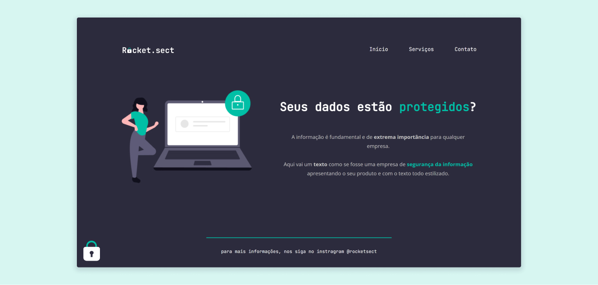

<h1 align="center">Projeto Rocket.sect</h1>

Projeto de landing page para uma empresa fictícia de segurança da informação.

## Conceitos em destaque
- HTML semântico
- Posicionamento de elementos
- Flexbox
- Utilização do DevTools
- Acessibilidade no HTML

## Principais tecnologias

- HTML
- CSS
